# ComposeNow Plugins

Backend subsystem for cloud execution of VST3 plug-ins. This repository is part of **ComposeNow**: the client VST Bridge sends audio and control events to the cloud, while this subsystem routes sessions, runs DSP on dedicated Worker nodes, and persists session state in Redis.

> This README describes the current code in this repository. The master's thesis covers the design of the entire ComposeNow system and earlier development stages; some of its diagrams are broader or older than the current implementation.

## Purpose

ComposeNow runs resource-intensive VST instruments and effects remotely. Users work in their DAW through a client bridge plug-in, while server nodes handle the computational load.

The original design goals are:

- an extensible catalog of VST instruments and effects;
- independent scaling of the ingress gateway and DSP workers;
- recovery after Worker failures;
- session state stored outside any individual Worker process;
- limits on traffic and memory consumption by untrusted clients;
- realtime and offline processing;
- low latency: under 100 ms is a system-wide design target, not a guarantee without measurements of the actual network, plug-in, and node configuration.

## Repository scope

| In this repository | Elsewhere in ComposeNow |
| --- | --- |
| WebSocket Proxy for audio sessions | Client VST3 Bridge running inside a DAW |
| Worker with a native VST3 host wrapper | Website and user interface |
| Block routing between Worker nodes | User accounts and authentication |
| Redis Streams, checkpoints, and ownership leases | Subscriptions, payments, favorites, and news |
| Plug-in and event domain models | Main business database and related services |
| Docker environment and VST artifact builds | Ingress, Kubernetes manifests, and external monitoring |

## Architecture

```mermaid
flowchart LR
    DAW["DAW + ComposeNow VST Bridge"]
    Proxy["Proxy<br/>WebSocket adapter"]
    Coordinator["Application<br/>AudioSessionCoordinator"]
    Router["Worker router<br/>rendezvous hashing"]
    Worker["Worker<br/>gRPC adapter"]
    Handler["Application<br/>ProcessPluginBlockHandler"]
    Registry["VST engine pool"]
    Native["VstEngine + native VST3 host"]
    Plugin["Headless VST3 plugin"]
    Redis[("Redis")]

    DAW <-->|"audio, MIDI, parameters"| Proxy
    Proxy --> Coordinator
    Coordinator --> Router
    Router -->|"ProcessBlock gRPC"| Worker
    Worker --> Handler
    Handler --> Registry
    Registry --> Native
    Native --> Plugin

    Router <-->|"workers, heartbeat, ownership"| Redis
    Coordinator <-->|"events and session state"| Redis
    Handler <-->|"streams, checkpoint, ACK"| Redis
```



### Projects and layers

| Project | Responsibility |
| --- | --- |
| `Domain` | `Plugin` and `PluginEvent` entities, typed identifiers, enums, invariants, and model factories. Independent of infrastructure and transport. |
| `Application` | Processing workflows, audio session coordination, block handling, and repository, routing, and VST engine contracts. Defines the workflow without depending on Redis, WebSocket, gRPC, or native API details. |
| `Infrastructure` | Redis repositories, plug-in catalog, Worker discovery, heartbeats, ownership leases, and routing. |
| `Proxy` | Ingress ASP.NET Core process: WebSocket protocol, message validation, session adapter, and Worker gRPC client. Does not run VST plug-ins directly. |
| `Worker` | ASP.NET Core/gRPC execution process: engine instance registry and native VST host adapter. DSP runs only here. |

Dependencies point inward: `Domain` has no dependencies on other projects, `Application` depends on `Domain`, and external adapters implement application-layer interfaces. This is a Clean Architecture/Ports and Adapters approach adapted to two independently deployed processes.

## Audio block processing

1. VST Bridge opens a WebSocket to `Proxy` and sends the audio session parameters.
2. `Proxy` validates the handshake, message sizes, and channel, frame, and event counts.
3. `AudioSessionCoordinator` receives audio and commands independently of the transport.
4. The router selects a live Worker using rendezvous hashing and an ownership lease.
5. `Proxy` calls `PluginWorker.ProcessBlock` over gRPC. Audio is sent as little-endian `float32` in a `bytes` field.
6. Worker restores events and the checkpoint, leases a `VstEngine` instance from the registry, and runs DSP.
7. State and results are committed to Redis before the Redis Stream message is acknowledged with `ACK`.
8. The processed block returns to the client over WebSocket.

If a Worker stops renewing its heartbeat, its ownership lease expires. Another live Worker can claim pending messages through the consumer group/`XAUTOCLAIM` and resume from the saved checkpoint. Owner fencing protects state from late writes by the old Worker.

## Concurrency and VST instances

- Proxy and Worker serve requests through the .NET ThreadPool and asynchronous I/O.
- Different connections (`pluginId`) using the same VST type can run concurrently in separate `VstEngine` instances.
- A processing gate serializes work for each `pluginId`, preventing adjacent blocks from overwriting each other's state.
- Worker uses a bounded asynchronous pool per VST name. An available engine is leased for a block, and the connection's state is restored before DSP.
- Pool size defaults to `Environment.ProcessorCount`, reflecting the CPU quota available to the .NET process. Environment variables can restrict it for memory-intensive VST plug-ins.
- Idle engines are unloaded after their TTL; Worker shutdown releases remaining native resources.
- Worker replicas distribute ownership keys among themselves. More `replicas` allow greater concurrency, but do not create simultaneous processors for one stateful session.

There is no dedicated DSP thread pool yet: synchronous native calls run in the Worker request-processing context. Strict realtime guarantees would require separate DSP scheduling, deadline-miss measurements, and isolation of slow plug-ins.

## WebSocket protocol

Endpoint: `GET /ws?mode=audio&plugin=<name>&pluginId=<id>&leaseId=<lease>`.

Initial text handshake:

```text
hello <sampleRate> <blockSize> <channels> <mode>
```

Supported text control commands are `note on`, `note off`, `param`, and `panic`. Binary frames are:

| Magic | Purpose |
| --- | --- |
| `CRD0` | Credit-based flow control |
| `EVT1` | Plug-in events |
| `AIN1` | Uncompressed input audio block |
| `AIZ1` | zlib-compressed input audio block |
| `AUD1` | Uncompressed output audio block |
| `AOZ1` | Compressed output audio block |

Output is compressed only when it saves enough space; ineffective compression triggers adaptive backoff.

### Safety limits

| Limit | Maximum |
| --- | ---: |
| WebSocket message | 16 MiB |
| Text WebSocket message | 4 KiB |
| Sample rate | 768 000 Hz |
| Frames per block | 16 384 |
| Channels | 32 |
| Events per block | 4 096 |
| Outstanding credits | 4 096 |
| Compressed payload | 8 MiB |
| Uncompressed payload | 16 MiB |
| Buffered blocks | 256 |
| Future sequence distance | 512 |

Oversized messages cause the transport to close the WebSocket with `MessageTooBig`.

## Plug-in catalog

The current configuration includes:

- `SineSynth`;
- `Piano`;
- `Delay`;
- `Reverb`.

Native artifacts are mounted into Worker through `VST3_PATH` (default: `/plugins`). The host wrapper library is resolved relative to `VST_HOST_LIB_DIR`.

To add a plug-in:

1. Prepare a headless VST3 target in the artifact source directory.
2. Build the artifact using `Artifacts.dockerfile`.
3. Add the plug-in to the Proxy and Worker catalogs.
4. Include the resulting bundle in the production Worker image.
5. Verify state save/restore, parameters, MIDI events, and multichannel audio I/O.

## Running locally

### Requirements

- Docker with Compose v2;
- .NET SDK 9 for running outside containers;
- VST3 SDK and headless plug-in sources for rebuilding native artifacts;
- the external Docker network `radx` used by the current Compose files.

### Preparation

```bash
cp .env.example .env
docker network create radx
```

Paths `VST3_PLUGINS` and `VST3_SDK` in `.env` are relative to the `_docker` directory.

### Docker Compose

```bash
make rebuild ENV=local
make up ENV=local
```

To stop:

```bash
make down ENV=local
```

Local Compose uses `expose`, not published `ports`: services are accessible to containers on `radx`, but not directly from the host. Host access requires an existing reverse proxy on that network or a local port-mapping override.

Set the Worker replica count with:

```bash
PLUGIN_WORKER_REPLICAS=2 make up ENV=local
```

### Building VST artifacts

```bash
make build PLUGIN=SineSynthHeadless
```

This uses `_docker/docker-compose.artifacts.yml` and `_docker/Dockerfile/Artifacts.dockerfile`. `PLUGIN` must match a CMake target in `VST3_PLUGINS`.

## Production

Proxy and Worker images are built separately:

- `_docker/Dockerfile/Proxy.dockerfile`;
- `_docker/Dockerfile/Worker.dockerfile`.

```bash
make rebuild ENV=prod
make up ENV=prod
```

Production Compose starts two Worker replicas by default for resilience and parallel processing of independent sessions. For Kubernetes, publish two separate images and define replica counts, probes, requests/limits, persistent configuration, and network policy in the infrastructure repository. This repository does not yet contain Kubernetes manifests.

## Configuration

| Variable | Purpose |
| --- | --- |
| `ENV` | Selects `docker-compose.local.yml` or `docker-compose.prod.yml` in the Makefile |
| `PLUGIN_WORKER_REPLICAS` | Worker replica count in Compose |
| `REDIS_PASSWORD` | Redis password |
| `PLUGINS_REDIS_HOST` | Redis host; default: `redis` |
| `PLUGINS_REDIS_TIMEOUT_MS` | Redis operation timeout; default: 15 000 ms |
| `VST3_PATH` | Root directory for VST3 bundles inside Worker |
| `VST_HOST_LIB_DIR` | Native host wrapper directory |
| `VST_ENGINE_POOL_MAX_TOTAL_INSTANCES` | Total engines per Worker; default: `Environment.ProcessorCount` |
| `VST_ENGINE_POOL_MAX_INSTANCES_PER_PLUGIN` | Engines per VST type; defaults to the total limit |
| `VST_ENGINE_MAX_STATE_BYTES` | Maximum binary state per VST; default: 64 MiB |
| `VST_ENGINE_POOL_IDLE_SECONDS` | Idle time before unloading an engine; default: 120 seconds |
| `VST_ENGINE_POOL_SWEEP_SECONDS` | Background pool cleanup interval; default: 30 seconds |
| `PLUGIN_WORKER_ID` | Stable Worker identifier; defaults to the hostname |
| `PLUGIN_WORKER_PUBLIC_ADDRESS` | Worker gRPC address published in the registry |
| `PLUGIN_NODE_ID` | Proxy node identifier |
| `PLUGIN_NODE_PUBLIC_WS_URL` | Public WebSocket URL of the Proxy node |
| `REQUIRE_PLUGIN_LEASE` | Requires `leaseId` when opening a session |
| `COMPOSE_NOW_METRICS_KEY` | Internal metrics endpoint key; no data is exposed without it |
| `COMPOSE_NOW_PLUGIN_BUSY_THRESHOLD_PERCENT` | Node utilization threshold; default: 90% |

See [`.env.example`](.env.example) for the full local development configuration.

## Observability

- `GET /healthcheck` — Proxy health endpoint;
- `GET /internal/system/metrics` — internal Proxy metrics;
- `X-ComposeNow-Metrics-Key` — internal metrics access key;
- Worker heartbeat: every 3 seconds, with a 12-second record TTL;
- Proxy node heartbeat: every 5 seconds, with a 20-second record TTL;
- `/tmp/compose-now-draining` puts the Proxy node into draining mode.

Production requires external metrics and log collectors, plus alerts for latency/error rates, Redis lag/pending entries, active engine count, native memory, and DSP block duration.

## Security and resource management

- A single-use `leaseId` is consumed with an atomic Redis compare-and-delete operation.
- Plug-in identifiers, text commands, audio frames, events, and parameter counts have upper bounds.
- Noncanonical binary frames, trailing bytes, and audio containing `NaN`/`Infinity` are rejected before native calls.
- State returned through the VST C API is capped by `VST_ENGINE_MAX_STATE_BYTES` before allocating a managed array.
- Production HTTP/WebSocket responses do not expose unexpected internal exception details; the complete error stays in the server log.
- Metrics remain unavailable until `COMPOSE_NOW_METRICS_KEY` is explicitly configured.
- Heartbeat membership is cleaned up on normal shutdown, and crashed nodes are removed periodically.

Worker gRPC is an internal trusted interface without application-level authentication. In production, isolate it from external traffic using a separate network, firewall, or Kubernetes `NetworkPolicy`. `leaseId` is currently passed in the query string; reverse proxies and access logs must redact it.

## Repository layout

```text
.
├── ComposeNowPlugins.sln
├── Directory.Build.props
├── Makefile
├── _docker/
│   ├── Dockerfile/
│   ├── docker-compose.artifacts.yml
│   ├── docker-compose.local.yml
│   └── docker-compose.prod.yml
├── docs/
│   └── thesis/
└── src/
    ├── Application/
    ├── Domain/
    ├── Infrastructure/
    ├── Proxy/
    └── Worker/
```

## Design documentation

The original thesis covers domain analysis, requirements, UML, implementation, and deployment of the entire ComposeNow system. All 45 embedded figures were extracted unchanged into the [thesis materials directory](docs/thesis/README.md).

The diagram below shows the thesis's conceptual server architecture. The Architecture section above describes the current code structure and interactions.


## Limitations and future work

- Isolate DSP from the general request ThreadPool using a controlled thread count and bounded queue.
- Add deadline, jitter, queue-wait, and native DSP duration metrics by plug-in type.
- Investigate sharing immutable plug-in resources between instances. This requires support from the native plug-in or a separate host process; arbitrary VST memory cannot be safely shared.
- Isolate unstable VST plug-ins in separate processes so native crashes do not terminate the entire Worker.
- Define a storage strategy for large VST states: the current configurable safety limit is 64 MiB, but Redis also limits value size, while JSON/base64 introduces another copy and increases data volume.
- Add failover integration tests for Worker loss before/after a checkpoint, redelivery, and fencing the previous owner.
- Publish a formal binary WebSocket protocol specification and compatibility policy in a separate document.

## Architectural references

- [Microsoft: Common web application architectures](https://learn.microsoft.com/dotnet/architecture/modern-web-apps-azure/common-web-application-architectures)
- [Microsoft: Worker services in .NET](https://learn.microsoft.com/dotnet/core/extensions/workers)
- [ASP.NET Core gRPC](https://learn.microsoft.com/aspnet/core/grpc/)
- [Redis Streams and consumer groups](https://redis.io/docs/latest/develop/data-types/streams/)
- [Steinberg VST 3 Developer Portal](https://steinbergmedia.github.io/vst3_dev_portal/)
- [Docker Compose deploy specification](https://docs.docker.com/reference/compose-file/deploy/)

## Status

The project is under active development. APIs, the binary protocol, Redis schemas, and deployment configuration are not yet stable and may change without backward compatibility.
